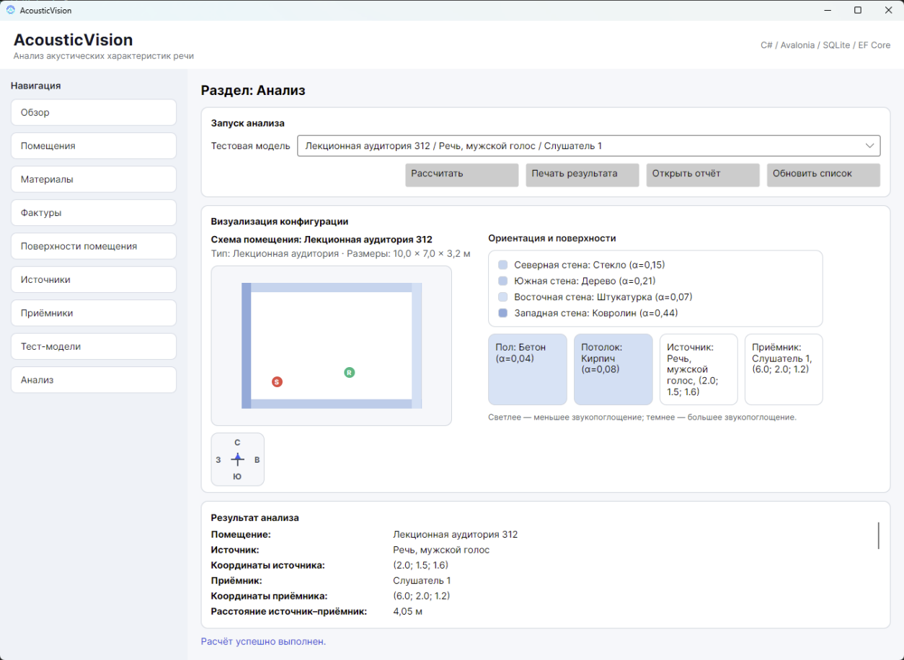
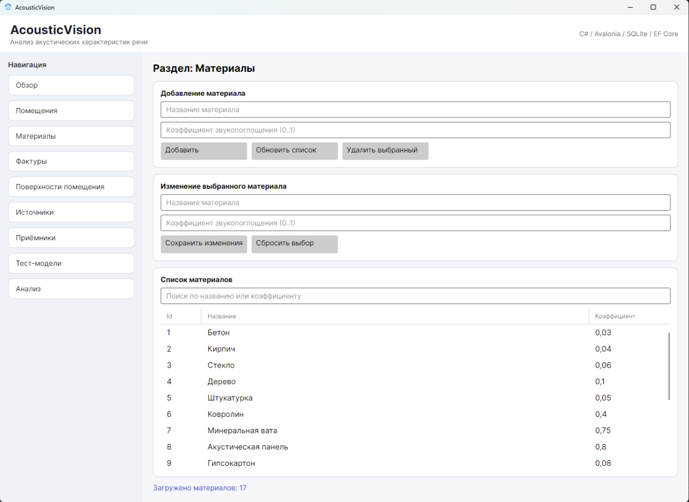
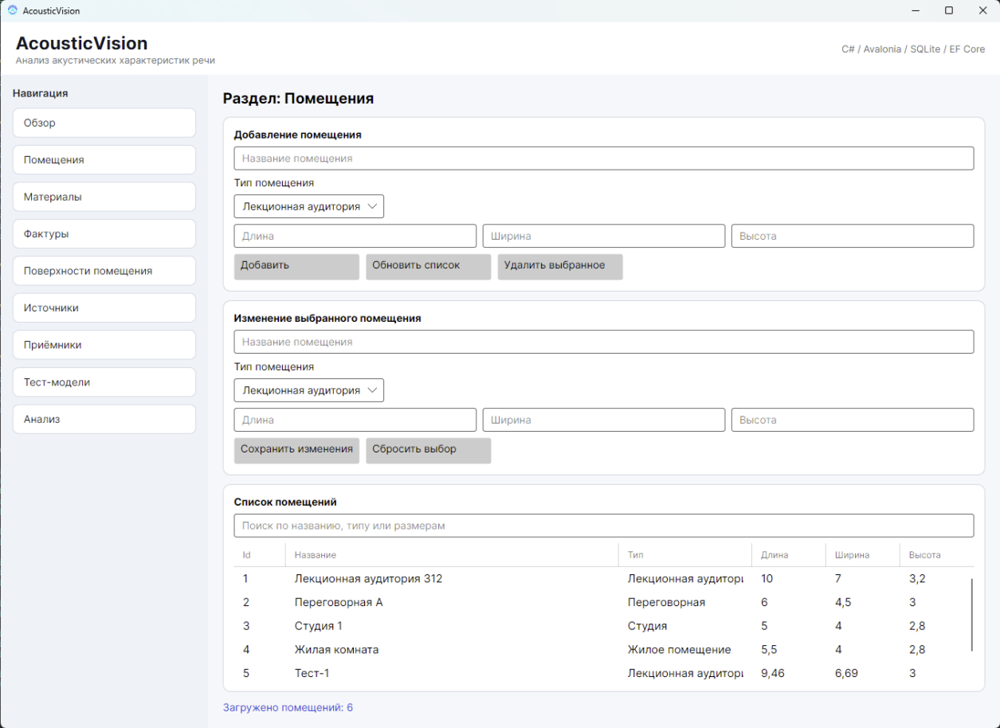
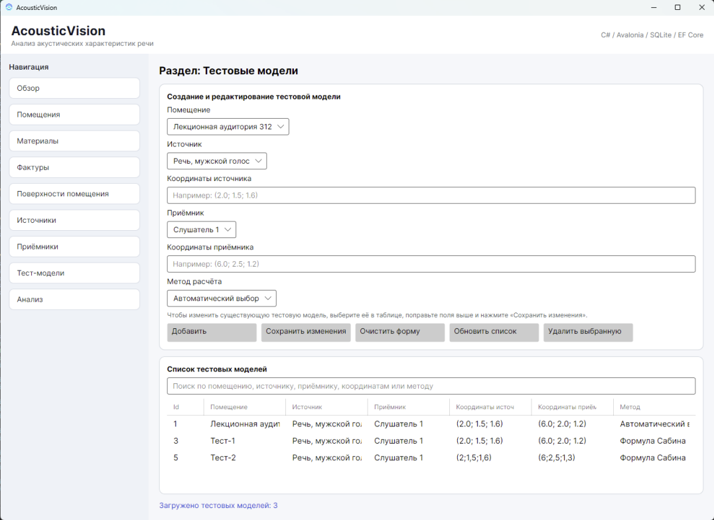

# AcousticVision

Cross-platform desktop application for room acoustic analysis and preliminary speech intelligibility estimation.

Built with **C#**, **.NET 8**, **Avalonia UI**, **Entity Framework Core** and **SQLite**.

> Master's project focused on designing a software system for analysing acoustic characteristics of speech in enclosed spaces.



## Features

- Room and surface configuration
- Material and texture management
- Sound source and receiver management
- Reusable analysis models
- RT60 calculation using Sabine and Eyring equations
- Automatic calculation method selection
- Source-to-receiver distance analysis
- Preliminary speech intelligibility estimation
- Room configuration visualization
- Result reporting
- Light and dark UI themes

## Tech Stack

| Technology | Purpose |
|---|---|
| C# | Main programming language |
| .NET 8 | Application platform |
| Avalonia UI | Cross-platform desktop UI |
| Entity Framework Core | Data access |
| SQLite | Local persistence |
| CommunityToolkit.Mvvm | MVVM infrastructure |
| Microsoft.Extensions.DependencyInjection | Dependency injection |

## Architecture

The application follows the **MVVM** pattern and separates presentation, application logic and persistence.

```text
Avalonia Views
      │
      ▼
  ViewModels
      │
      ▼
   Services
      │
      ▼
AppDbContext
      │
      ▼
    SQLite
```

The main domain entities include rooms, surfaces, materials, textures, sound sources, receivers, test models and analysis results.

## Screenshots

### Analysis


### Materials



### Rooms



### Test Model


